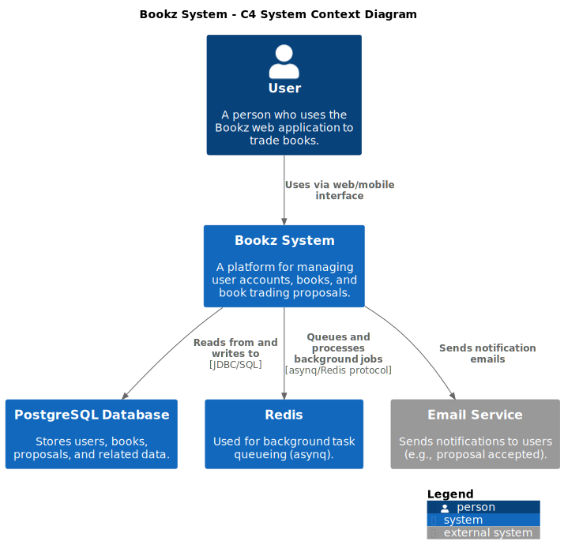
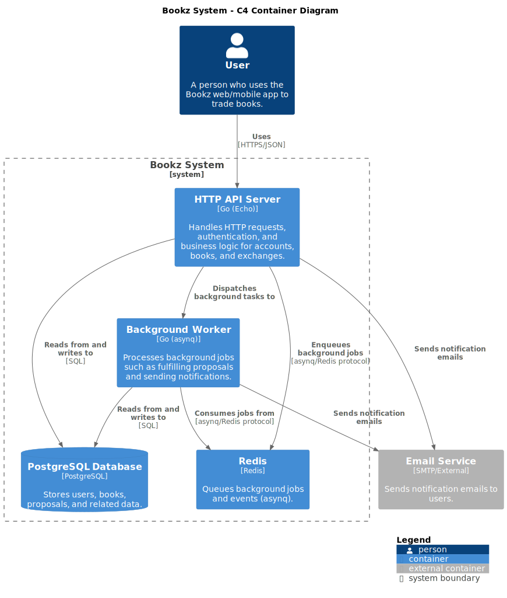
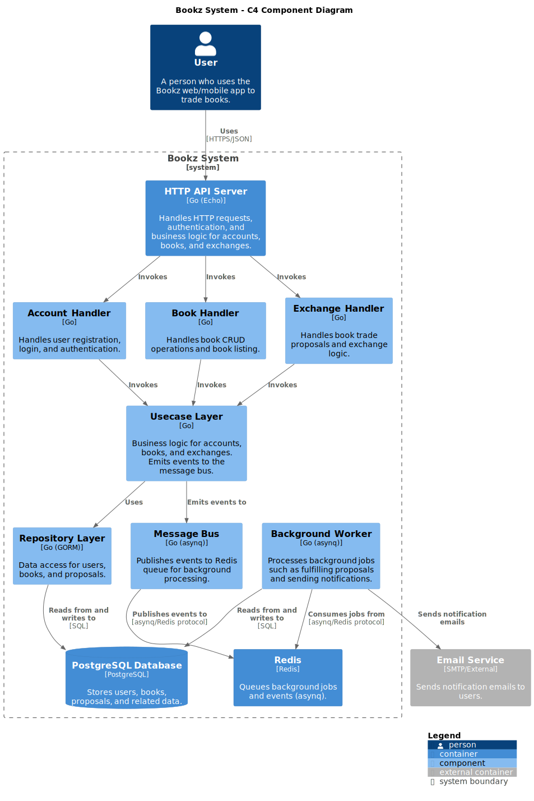

# Overview

The Bookz System is a backend platform that enables users to manage their accounts, add and browse books, and propose or accept book trades with other users. It provides a secure and organized environment for book trading, handling user authentication, book ownership, and trade proposals. The system integrates with a PostgreSQL database for persistent storage, Redis (via asynq) for background job processing, and external services like email for notifications and Sentry for error monitoring.

## Table of Contents

- [System Context](#system-context)
- [Container](#container)
- [Component](#components)
- [Architecture Details](architecture.md)
- [Flow exchange books](flow_exchange.md)

## System Context

- **User**: Interacts with the Bookz System through a web or mobile interface to manage books and trades.
- **Bookz System**: The core backend application that processes user requests, manages business logic, and coordinates data flow.
- **PostgreSQL Database**: Stores all persistent data, including users, books, and proposals.
- **Redis**: Used for background task queueing and processing (e.g., handling asynchronous events).
- **Email Service**: Sends notifications to users, such as when a trade proposal is accepted.

## Container

- **HTTP API Server**: Go/Echo application (handlers, usecases, repositories).
- **Background Worker**: Go/asynq worker for processing background jobs (e.g., proposal fulfillment).
- **PostgreSQL Database**: Persistent storage for all business data.
- **Redis**: Used by asynq for job queueing.
- **Email Service**: Sends notifications (e.g., proposal accepted).
- **User**: Interacts with the API via web/mobile.

## Components

- **HTTP API Server**: The main Go/Echo application that exposes RESTful endpoints. It routes requests to the appropriate handler (Account, Book, Exchange), which then invoke the business logic in the Usecase Layer.
- **Handlers**: Entry points for each domain (Account, Book, Exchange). They validate requests, handle authentication, and call the corresponding usecase methods.
- **Usecase Layer**: Contains the core business logic for user management, book operations, and exchanges. It also emits events to the Message Bus for background processing.
- **Repository Layer**: Handles all data access, reading from and writing to the PostgreSQL database using GORM.
- **Message Bus**: Publishes events (such as proposal accepted) to the Redis queue using asynq, enabling asynchronous processing.
- **Background Worker**: Consumes events from Redis, processes background jobs (like fulfilling proposals and sending notifications), and interacts with the database and email service as needed.
- **PostgreSQL Database**: Stores all persistent data, including users, books, and proposals.
- **Redis**: Used as a queue for background jobs and events, enabling reliable asynchronous processing.
- **Email Service**: An external system that sends notification emails to users (e.g., when a trade proposal is accepted).
- **User**: Interacts with the system via web or mobile interface, performing actions such as managing books and initiating trades.
