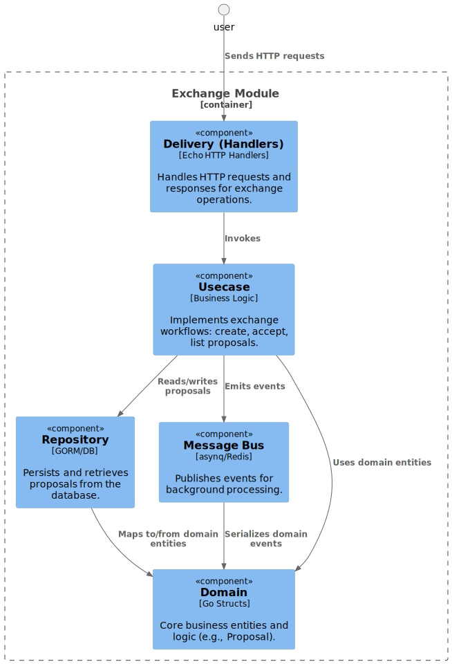

# Clean Architecture

This project follows the Onion/Clean Architecture pattern. The architecture is apply for each module not the whole source code

Key principles:
- Dependencies flow inward
- Inner layers contain business logic
- Outer layers contain implementation details
- Domain entities are at the core
- Each layer is isolated and testable

## Exchange Module

The exchange module follows clean architecture principles, separating concerns into distinct layers

### Delivery (API layer)

Handles HTTP requests and responses. In this project, this is implemented by the Echo handlers in handlers.go. It parses input, invokes usecases, and formats output.

### Repository (Infras)

Responsible for data persistence and retrieval. The repository interfaces and implementations (e.g., repository.go) abstract away the database details from the business logic.

### Message Bus (Infras)

Handles event publishing for asynchronous processing (e.g., proposal accepted events). Implemented in bus.go, it emits events to Redis via asynq.

### Usecase Layer (core)

Contains business logic for exchange operations (e.g., creating, accepting, and listing proposals). This is implemented in services.go. It orchestrates the workflow, interacts with repositories, and emits events via the message bus.

### Domain Layer (core)

Contains core business entities and logic, such as the Proposal struct and related methods in proposal.go.

### Flow Example

A user sends a proposal via the HTTP API → Handler parses and validates the request → Usecase creates a proposal and saves it via the repository → On acceptance, the usecase emits an event via the message bus → The worker processes the event asynchronously.

### Diagram

