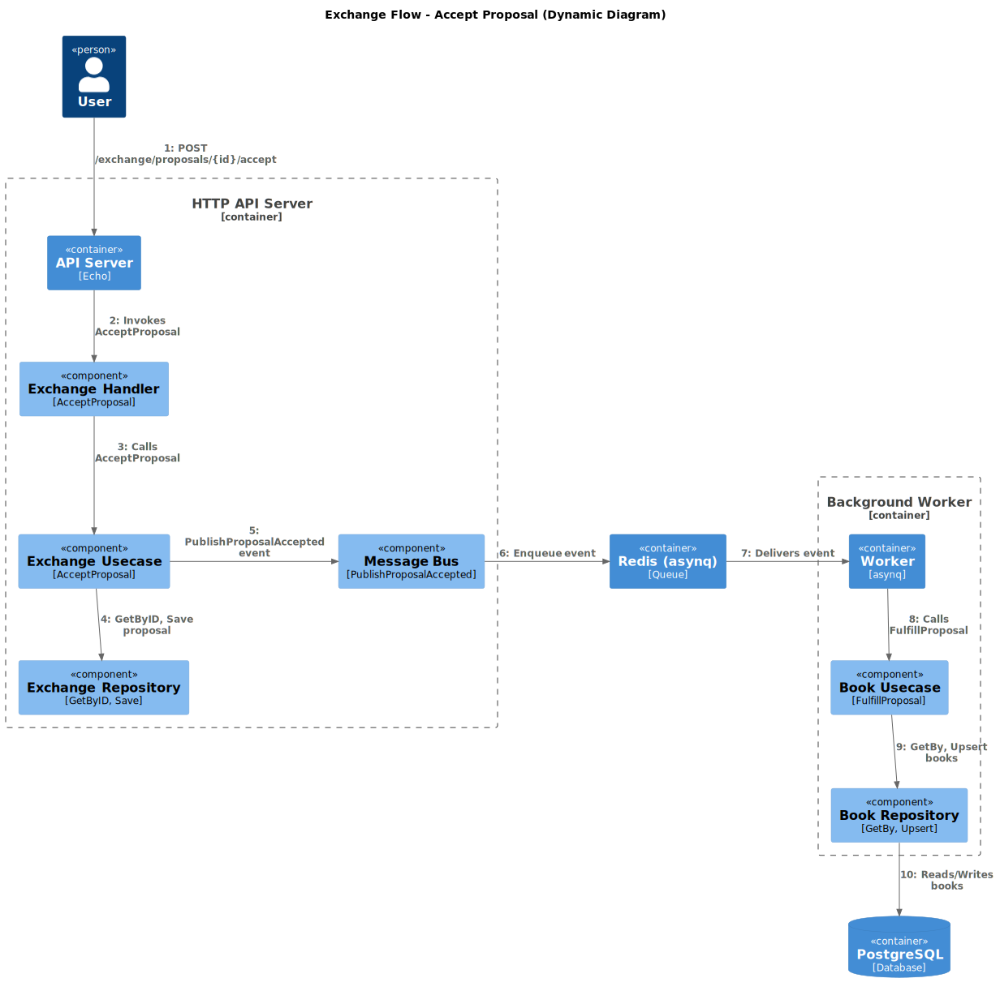

# Exchange Books

The exchange flow describes the process of accepting a book exchange proposal between users. This flow ensures that book ownership is updated correctly and that all business rules are enforced, even when some steps are handled asynchronously for reliability and scalability.

## Diagram

The dynamic diagram descrribe the exchange flow

## Explanation

1. User Action

    A user sends a request to accept a book exchange proposal by making a POST request to the API endpoint /exchange/proposals/{id}/accept.

2. API Server (HTTP API Server)

    The API server receives the request and passes it to the Exchange Handler.

3. Exchange Handler

    The handler validates the request and calls the Exchange Usecase’s AcceptProposal method.

4. Exchange Usecase

    The usecase retrieves the proposal from the repository, performs business logic (such as checking permissions and proposal status), and saves any updates.
    It then emits a ProposalAccepted event to the message bus for asynchronous processing.

5. Message Bus

    The message bus publishes the event to the Redis queue (using asynq).

6. Redis Queue

    The event is stored in Redis, waiting for a background worker to process it.

7. Background Worker

    The worker listens for new events in the Redis queue. When it receives a ProposalAccepted event, it triggers the Book Usecase’s FulfillProposal method.

8. Book Usecase

    The Book Usecase performs the actual exchange it retrieves the involved books, swaps their owners, and persists the changes using the Book Repository.

10. Book Repository

    The repository updates the book records in the PostgreSQL database.

11. Database

    The PostgreSQL database stores the updated book ownership information.